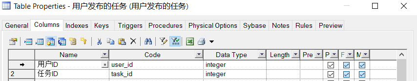
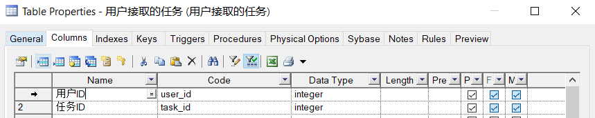
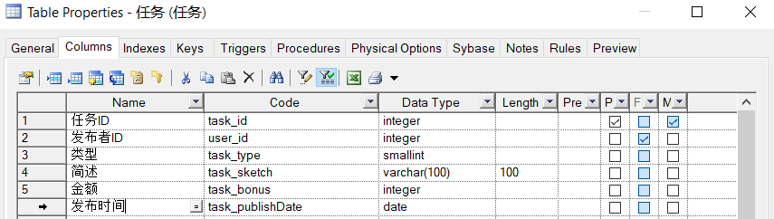
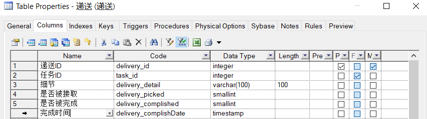
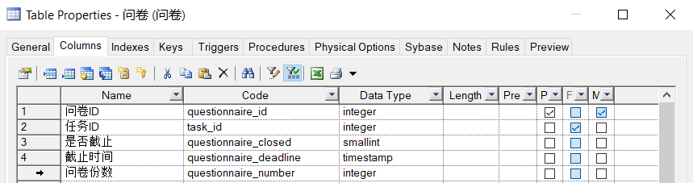

```
Name: 字段名称
Code: 字段名称的英文
Data Type: 字段类型
Length: 字段长度
Pre: Precision, 精确到第几位
P: Primary key, 主键
F: Foreign key, 外键
M: Mandatory, 强制填写
```


# 用户


# 学生


# 用户关注的对象


# 关注用户的对象


# 开支账单


# 用户发布的任务




# 用户接取的任务




# 任务



# 递送



# 问卷



# 题目


# 答卷


# 回答

