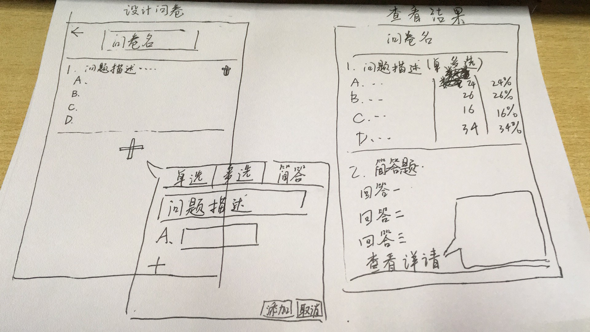

#### UI方面

瞎画的= =




#### 数据库方面

**总问卷表**

| 问卷id | 发布人id | 问卷名 |
| ------ | -------- | ------ |
|        |          |        |

**题目表**

| 问卷id | 题目id | 题目类型                | 题目描述 | 选项1 | 选项2 | 选项3 | ...... |
| ------ | ------ | ----------------------- | -------- | ----- | ----- | ----- | ------ |
|        |        | 1：单选 2：多选 3：简答 |          |       |       |       |        |

**答卷表**

| 问卷id | 题目id | 答卷人id | 答案                                  |
| ------ | ------ | -------- | ------------------------------------- |
|        |        |          | 多选题格式（1 2 4这样的数字空格数字） |


#### 类

题目

```java
public class Question {
    private enum Type {SINGLE_CHOICE, MULTY_CHOLCE, SHORT_ANSWER};
    private int id;
    private String name;
    private String description;
    private Type answerType;
    private int optionNum;
    private String[] optionDescription;
    private String answer;
}
```

调查问卷

```java
public class Questionnaire{
    private int id;
    private String name;
    private int questionNum;
    private Question[] questions;
}
```


#### API

发布问卷：

？

答卷：

？

获取问卷结果：

？